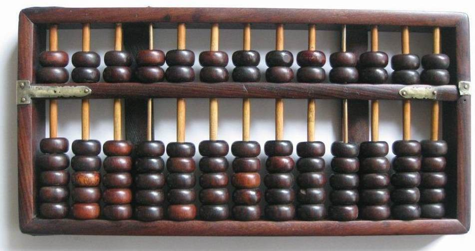
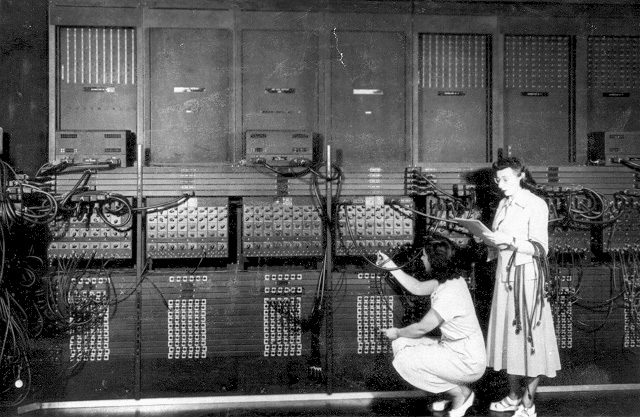
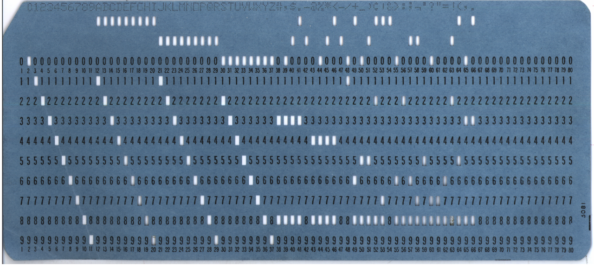

# 第一章-编程所谓何物

简单点来说，编程就是编制程序（呵呵，这不是废话么...）。程序是让计算机发挥功能的命令的集合，大体上有两种形式，让计算机真正执行的是电脉冲形式，叫机器码，譬如0101这种二进制数字。程序员编制的通常是文本形式，叫源代码。使用一个称为编译器/解释器的工具，可以把源代码转变为机器码。而编程就是产生那些源代码的工作。这个工作类似于谱曲、编菜谱、写工作手册。我们知道，谱曲和菜谱并不是一蹴而就的，往往需要反复的修改，直到最后满意为止，编程也是一样。

## 编程的对象——计算机

一般来说，如果你看到的这篇文章是电子版的话，你眼前的东西就是计算机，也就是俗称电脑的东西。这样的说法对普通用户来说是已经足够了，但是电气工程师认为一堆电路板、缆线、马达、和机壳的组合才算，联想的销售人员认为他们卖的那些方块才是计算机，而中央军委的人大概觉得银河V才能称得上。程序员的看法和他们并不完全相同，在程序员看来，只要能自动计算的东西，就是计算机。这个说法的重点在于自动和计算这两个词。广义的计算是指能对外界的某种输入做出反应，不一定就是数学运算。比如电梯就可以对按键做出反应，所以它也是能计算的。自动是说计算是通过自身的运作来完成的，不需外界干预。

在有电的时候，电梯就可以自动运行，这样看来电梯也是计算机。算盘虽然能计算，但不是自动完成的，不过如果把打算盘的人一起算上，那就是不错的计算机了。使用指纹或虹模的智能锁、秦始皇陵里的机关和自动钢琴似乎也都是一种计算机，情况确实是这样，计算无处不在，计算机也无处不在。甚至可以把我们的世界看作一台巨大的计算机，然后就觉得我们是生活在Matrix里，这是一个很有意思的哲学问题，有兴趣就去看看黑客帝国三部曲吧。通常在实际编程中，程序员只考虑现代数字电子计算机，也就是使用电能为动力，在运算时以电子电路和逻辑代数为基础的计算机。他们用途广泛，种类也是极其繁多，手机、PC、服务器是比较常见的样子，电梯、收银台、智能门禁则是各种隐藏的版本。虽然设备的外在形式千变万化，但现代电子计算机的基本原理和体系结构并没有太大的变化。

### <a name="why-binary"></a>为什么要使用二进制

从计算机导论课程（或其他相关课程）我们知道在计算机底层是用二进制来表示各种信息的，有些人肯定会问计算机底层为什么不用咱们熟悉的十进制来进行各种运算？这样不是更接近人类的思考习惯么？这种想法还是不错的，你看咱们人类多聪明，让计算机使用十进制它是不是同样会变得很聪明呢？很遗憾的告诉你，不会，至少目前不会，那样只会拖累它，想想地球上有一半人改用火星文进行沟通，会出现什么情况？计算机的全称为电子计算机，既然是基于电子组成的，它就得遵循电子世界的规矩。

在数字电路中一般用0表示低电平，1表示为高电平。电平是个逻辑量（就是聪明的人类根据自己的思维逻辑定义的一种东西），只有逻辑高、逻辑低两种值，但逻辑的高低是用电压的大小来表示的。譬如与电源负极的电压差值很小的某一点可以表示为逻辑低电平——0，电压差值很大的那一点则可以表示为逻辑高电平——1。在目前的电路结构中，判断逻辑高、低电平两种状态是很容易做到的，而要判断多于两种状态则比较麻烦。

## 为什么需要编程

编程这件事存在，完全是迫不得已，人类发明了计算机，想让它做事，仅此而已。但机器有三大特点，使得如果要让机器做事，完全不像吩咐人那么简单。

### 第一个特点就是机器很傻

很多人希望自己像计算机一样聪明，真要是那样你就完了，赶紧卷好被子回家吧，不过待在竹园实验室也许是个不错的选择，至少还有你的难兄难弟陪着你——值班桌上那台破破烂烂的电脑。For example, 从三个数里选出最大最小值，人类可以一眼就看出，但机器只能先从两个里找出最大的，再把这个最大的和第三个比较，然后再这样重复一遍找出最小值。如果是七个八个数，机器也是这样反复操作，O(∩\_∩)O\~是不是想到了冒泡排序？这就类似工地上搬砖，人类的做法一次搬很多很多砖，用推车或者别的运输工具把砖码得高高的然后运到目的地，但计算机的做法是每趟只搬一块砖，你没看错，每趟一块，一块只需998！998，抱回家！ =\_= 那为什么计算机这么厉害呢？

### 它的第二个特点，快而不乱

机器可以不知疲倦地用同一方法，重复重复再重复地做某件事，而且每次重复都相当的快。这一点是人类做不到的，让一个人搬一堆砖，也许没什么问题，但是一车砖就会让人疲惫不堪，如果有一火车皮的砖，想必大多数人想都不想就放弃了，即使有坚持去做的人，他的动作质量也只会越来越差。但机器不同，他搬砖不是每趟一块么，但他每趟来回的时间很短，比如少于0.00...001秒，不管砖头有多少，十万块也好，十亿块也罢，按同一方法处理，既没有差别也不会厌烦，直到全部处理完。真是不怕苦、不怕脏、不怕累，新时代的劳动模范呀！所以从总体来比较结果，机器就比人强了。还是以选最大最小数为例，人可以用肉眼检视三四个数，但超过100个数就要用其它的方法。对机器来说，三个和三万个数只是重复次数的差别，单调快速的重复，这就是机器的诀窍。想想金庸笔下的绝招都是啥？——把最简单的招数练到极致，那就是绝招呀！！！

### 更重要的一点，机器和我们言语不通

就是说，我们不可能一抬手一挑眉毛就吩咐它做事。不要和我抬杠说你可以用鼠标画圈让机器做事，也可以声控，那都已经不是纯粹的机器了。机器和我们处在不同的感知空间，所以它不能理解我们的言语。我们要命令它，必须用它能够理解的形式。从根本上来说，就是电脉冲——也就是节 [为什么要使用二进制](#why-binary) 所说的数字信号「0」和「1」。

基于以上这三个特点，要让机器做事情，就必须让把我们的要求转化成最简单适于重复的命令集合，而且是电脉冲形式。比如我们要让机器在屏幕上显示一幅图，首先我们要把这幅图分解成很多很多的小方格，也就是所谓像素，每个像素只有一个颜色，每个颜色都用一个很长的数字表示，然后所有这些数字转化成内存里的电平信号，再用另外的电路信号来一个个的把这些电平送到显像电路。所有这些电平和信号的集合就是程序，而编程，就是制造这些程序的工作。

也许有一天，我们不再需要编程序，程序员这个职业也将不复存在。不过我想如果那天到来，那就是机器已经能完全理解人类的语言和思想的时代了。在肉眼所及的范围里，似乎还看不到哩 :)

## 为什么要学编程

这个问题有两层意思。首先是编程为啥要学，很简单，因为这玩意不是生来就会，就像木匠活一样属于一门手艺，自然要通过学习才能掌握。你怎么也得花上几年来学英语不是么？第二层涵义才是重点，为啥我要学它？答案自然是因人而异：

1. 能提升和挑战自己的智力
3. 非常有趣儿
4. 编程是一门艺术
5. 造物主一般的感觉

以上几种都属于自虐一族... 再来看看以下几种

1. 学校的必修课程...
2. 可以赚好多好多钱
2. 一种莫名的优越感
3. 等等等等...

在我眼中，学习编程的意义更多的在于可以利用现代计算机技术来推动本专业和社会的发展，通过计算机（这里泛指广义的计算机）这个平台可以相对便利地实现自己的想法，说白了它就是一个很好的工具——「造物主一般的感觉」。对于非计算机专业的学生来说，了解一点编程的基础知识也是十分有利的——可以自己亲手实现那些天马行空的想法。现代的高级语言如 Python 玩起来就异常地爽，各种第三方库数都数不清。

## 编程到底是个什么玩意儿

计算机本身什么也做不了，必须依靠程序来指挥他做事。程序就是操作流程的顺序，或者说是顺序排列的多个操作过程，它是方法的描述，同时又往往包含着《孙子兵法》中**分而治之&&各个击破**的思想。

Long long ago, 有一个叫张三的人，是一个木匠，老本行是做家具的。一次李四让他帮做张摇椅，于是乎张三先把原木分割成木条木板，再把木条木板弯曲到指定的形状，然后把他们放置到适当的位置，接着设法固定他们，最后雕花抛光和上漆，一张漂亮的摇椅就做好了。这整个的流程如果记录下来，就是一个程序。

任何程序都有三个要素，执行者、操作对象（也称为资源）和操作方法（指令）。在做摇椅的这个程序里，张三就是执行者，木头就是他所对付的资源，在指令的持续作用下，木头（资源）的状态（如形状大小、颜色位置等）不断发生变化，最后，在程序结束时，木头变成了漂亮的摇椅。

电脑程序和上面一样，是方法的描述。只是这些程序的执行者不再是人，而是CPU，命令也变成了CPU的指令，而资源则是CPU可以改变其状态的东西，通常是内存，当然端口、硬盘等也是，不过一般的应用程序都只使用内存就可以完成工作。有的时候会听到别人说：「我的电脑内存是500G的，怎么玩起DOTA来还是很卡呢？」如果这种事情真的发生在你的电脑上，那我只能说：「恭喜你的电脑成功完成穿越，该电脑的准确生产年代不是史前，那应该就是在2014年之后。」一般来说个人电脑内存不超过8G，硬盘500G倒是比较普遍了。CPU并不直接从硬盘读取数据，而是通过内存间接获取。

有一点要注意，CPU其实并不知道自己在做什么，是程序在指挥CPU的运作。这一点比较难理解，让我们来看看算盘是如何完成计算的。



要使用算盘，只需要一件东西：口诀。记熟口诀（当然还有它对应的操作），就可以用算盘计算。在这个用算盘计算的过程里，口诀就是程序，指导着计算过程。算盘自身并不知道自己在计算，他只产生了物理上的一些变化（算珠位置的变化），做珠算的人同样也不需要知道，他只需要按照口诀调整算珠的位置。当程序结束的时候，算珠必定会处在某个位置上，这个位置的状态可以按照某种约定被读出，被读成某个数值，比如下面4个算珠全都在中档而上面的珠子没有落下的状态就是4。

操作和储存状态的设备并不需要知道状态是怎么转换成信息的，转换由阅读者来完成。举个不是非常准确的例子，显示器在显示图像的时候，在显示屏上总是按照如下的规则进行：

```
坐标(1,1)黑色、(1,2)白色、(1,3)白色、(1,4)白色、(1,5)白色、(1,6)白色、(1,7)白色、(1,8)白色、(1,9)白色、(1,10)黑色...

坐标(2,1)黑色、(2,2)黑色、(2,3)黑色、(2,4)白色、(2,5)白色、(2,6)白色、(2,7)白色、(2,8)白色、(2,9)白色、(2,10)黑色...
```

虽然显示器只是在适当的坐标显示黑色或是白色，但我们却在显示器上看到了文字、图片和动画，你不会认为显示器知道这些是鸟山明的漫画吧？如果你能造出这样的显示器，那真是太有才了！

计算机也是一样。比如计算圆周率的程序，CPU只是不断地对某一块内存进行操作，当程序结束的时候，这块内存恰好处在某种特殊的状态。而按照事先的约定，这个状态在被读出来的时候，它正好和圆周率相同，于是我们可以说，算出了圆周率。其实CPU只是在那里象手指头一样拨动内存的算珠而已。这种算珠极其简单，他只有两个位置，0和1，拨动它也很方便，电流就可以，但这种算珠实在太多，使得他们能组合起来表示很复杂的信息，就像只有黑白两色的屏幕点当数量足够多的时候，就可以用来表现有趣的漫画。

所以程序代表人期望电脑能做的事（注意不是电脑要做的事，这一直混淆着许多人），当人需要做这些事时，人提供指令，再给出某些资源以期电脑能对其做正确的改变。程序只是方法的描述，本身是不能发生任何效用的，直到它被执行，人为给定它一块内存，告诉它计算结果的精度及计算结果的存放位置后，他通过控制CPU才改变人为给定的这块内存的状态以表现出计算结果。

通常，我们把计算机的物理实体部分称为硬件，包括电路板、机箱、键盘鼠标等，而把不可见的非实体部分称为软件，软件大体就是程序和主要由程序产生的数据。广义的说，乐谱、菜谱、工作手册、仪器的操作说明也是某种程序，我们不妨称之为类程序。

### 编程语言又是怎么回事

如果以上所说的就是编程，那编程语言（比如C语言）又是怎么一回事？

菜谱、仪器的操作说明可以用法语来写、也可以用中文来写，不影响实质效果。因为人类生存在同一个四维物理时空中，具有相同或类似的感知。虽然人类的语言五花八门，但都可以通过翻译得到正解。

仪器操作说明、一般的菜谱，所描述的都是人类世界的事物，人类可以理解，因此它们可以用人类的语言来描述。但计算机程序显然与菜谱有不同，他是指挥计算机用的。首先CPU所能感受到的物理空间和与人类的感受严重不同，很多概念根本无法传达，其次没有大脑的计算机并不懂得人类的语言，何况人类的语言并不那么完美，很多事不能精确的描述，所以人类的语言不论英语还是中文都不能胜任这个任务。这个情况和音乐有点类似，解决方案是发明一种人造语言专门用于这个领域。比如五线谱就是一种专门的供音乐使用的人造语言（数字简谱也是，由于它与中国的工尺谱相当接近，所以在中国得到了最大程度的发扬光大，有点地方话的味道）。于是就有一些专门的纯粹用于计算机的语言被创造出来。

其中最早的一种基于电路原理，直接用0和1来表示电路的开关通断，不断的拨动开关，就形成了程序。这种语言就是机器语言，它可以直接被计算机听懂，但遗憾的是，人类虽然可以看懂这种语言，但它不符合我们通常的交流习惯，很难被人所阅读，更不要谈设计和修改了。

人类的智慧总是无穷的，后来人们提出这样一个方案，我们可以先按某种方法和规则，生成一个我们能看懂的指令序列（就是源代码），再通过某个转化的工具（就是编译器），把它变成机器可以运行的指令（也就是可执行程序）。这个我们能看懂的指令序列的规则的总和（也就是词汇和语法[[1]](#ref1)），就是我们通常说的计算机语言。为了和机器语言相区别，被称为高级语言。

章节开始所说文本形式的源代码其实是有些规定的，就像我们和老美用英语交流。首先你得说英文单词，不能冒法语词汇日文假名出来，其次你得按语法讲话，不能一个个单词往外蹦。程序也同样有词汇和语法上的一些规定，这些规定就构成一门语言。显然任何一门编程语言都是人造语言，既然是人造的东西，因发明人的想法而不同，就形成了不同的语言。当然，编程语言的区分远不止以上所说的词汇和语法上的不同，还有其运行机制也不完全一样。

常见的编程语言有很多种，静态语言如 C & C++ & JAVA, 前三种语言近几年几乎一直占据着TIOBE编程语言排行榜的前三甲，其他著名语言有Python, Ruby, Perl和Golang等。他们各有所长，在不同的领域发挥着各自的作用。但由于计算机的体系结构大致相同，这些语言也大同小异，具有共通之处。这情况很好理解，通常真实世界的拳法看起来都有点相似，只有漫画这类幻想作品里才会有手脚飞出或者口吐火焰眼下喷水这种怪异的事情发生。

### 编译器所谓何物

前边不少地方提到编译器，那是什么东东？——代码翻译机，前面的章节中或多或少地解释了这个东西。不过这里不介意再解释一次，是的，前文中提到过，程序其实是电脉冲形式的指令的集合——对机器这是绝对正确的。但你认为人类可以直接操作电脉冲么？——当然不能。所以最早的时候，程序员们是通过反复的拨动开关或者插拔插头来做这件事的，就像老电影里的电话接线员和发报员。下图为给ENIAC写程序的两只程序媛。



后来技术进化了，人们可以把脉冲信号设置在打了孔的纸带上，然后让纸带穿过有灯管的感应器，有孔电路就通，没有就是断，由纸带机实现了在电脉冲和纸带之间转换。老电影里的工程师们经常拿起一条长长的纸带来阅读——真是高深莫测啊！不过即使这样，要理解程序还是很困难，更别说阅读编写和修改了，人毕竟不是机器。下图为80列、矩形孔的标准的IBM打孔卡片，相当于存储器。



其实人们最习惯用来表达思想的方法是文字，于是人们设想能否直接写出文字形式的程序。通过不懈的工作，这个目标实现了。今天人们可以写出文本形式的称为源代码的程序，然后再利用特定的工具把代码转换成机器能理解的电脉冲形式，也就是目标程序。这种转换工具就叫做编译器，作用相当于翻译，以前是纯粹的机电设备，到了现代它也成了程序的一种。

从某种角度来说，其实没有任何人能被称为程序员，编译器才是真正的程序制造者。人所制造的只是源代码，从这个角度往下想的话，其实是程序在制造程序，换言之，程序在借助人类之手自我进化。还记得前边说过的Matrix么？

在这里顺便讲解下编译和解释的差别。编译器的工作本质上类同于翻译，而我们知道其实翻译有口译和笔译两种工作模式。程序员写完所有的源代码，由编译器一次性转为可执行文件留待以后执行，这种类似笔译的模式我们称为编译。程序员每次输入一行或数行代码，编译器马上把他转换并执行，接着等待程序员的后续输入，这种类似即时口译的方式就称为解释，此时编译器就被叫作解释器。C/C++ & Pascal等语言是编译型的，Perl & Python等语言就是解释型的，Java语言很特殊，他先编译成一种中间代码，然后在不同的机器上边解释边执行，这样就能实现跨平台运行，称为半编译模式，微软的.NET也是这种机理。现代的新型解释性语言很多都是半编译的——兼顾了运行效率和跨平台性。一般来说，编译型要比解释型的运行效率高些——因为不需要等待程序员的输入，也便于系统优化。但解释型在编程的时候容易排错，界面友好，而且通常程序编写比较方便，比如Python。但不管用哪种语言编程，你总需要一个编译/解释器。

现代的编译器，往往不止是编译器，它还会包含有着色和搜索等功能的代码编辑器，支持单步调试并行调试的调试器，能够读入文件的多个版本并进行比较分析的版本控制，编辑图标等的资源编辑器，在大型项目中用于统一协调的项目管理，和用于自动化代码生成的向导工具等等。这样的编译器，我们就称它为集成开发环境(IDE:Integrated development environment )，代表就是[开放源代码](http://zh.wikipedia.org/wiki/%E5%BC%80%E6%94%BE%E6%BA%90%E4%BB%A3%E7%A0%81)的[Eclipse](http://zh.wikipedia.org/wiki/Eclipse)和稍微有点软那个公司的[Visual Studio](http://zh.wikipedia.org/wiki/Visual_Studio)系列。

### Notes

<a name="ref1">[1]</a> 关于语言词汇和语法上的详细说明可参考[程序的基本概念-自然语言和形式语言](http://songjinshan.com/akabook/zh/intro.html#intro-naturalformallang)
