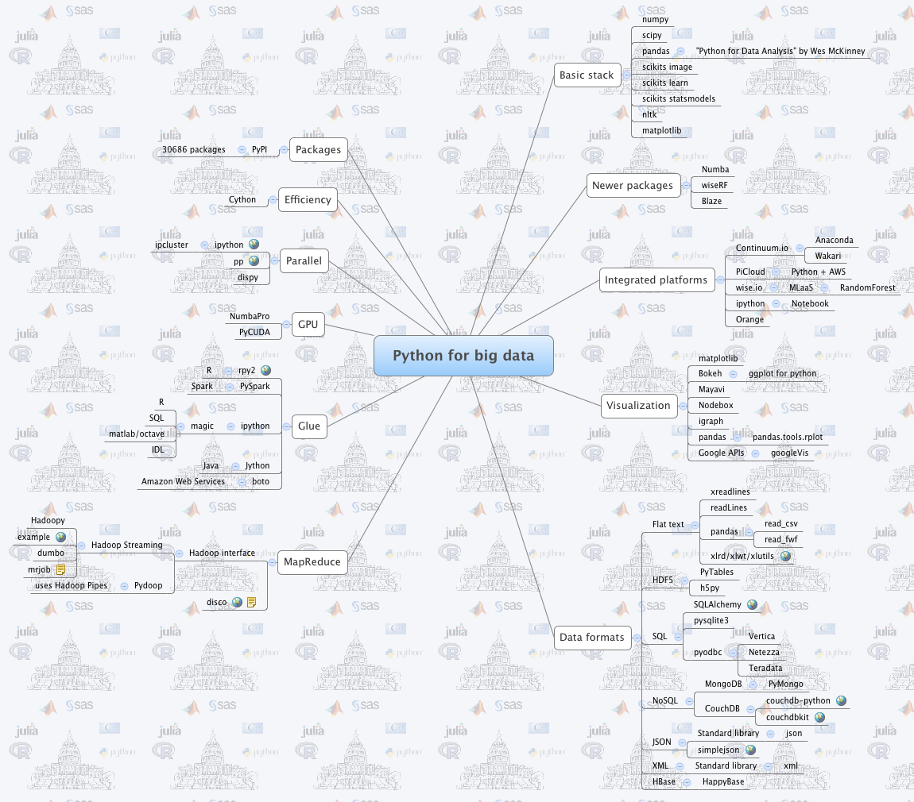

# 第五章-编程语言

如果读到这儿还不知道编程语言是啥的，请回头阅读第一章，下边的介绍仅仅只是蜻蜓点水式的，想详细了解的请自行Google或者Wikipedia，每种语言都有其优缺点和适用领域，不可一概而论。

## C

在第四章中已经初步提及了C语言的产生历史。C语言是一种通用的、过程式的编程语言，广泛用于系统与应用软件的开发。具有高效、灵活、功能丰富、表达力强和较高的移植性等特点，正是由于这些特点，在嵌入式领域也得到了最为广泛的应用。

C语言是由UNIX的研制者Dennis Ritchie于1970年由Ken Thompson所研制出的B语言的基础上发展和完善起来的。目前，C语言编译器普遍存在于各种不同的操作系统中，例如UNIX、MS-DOS、Microsoft Windows及Linux等。C语言的设计影响了许多后来的编程语言，例如C++, Java, Golang和C#等。

在发展的过程中，出现了许多略有差别的C语言版本。1989年，美国国家标准研究所(ANSI)为C语言制定了一套ANSI标准，就是所谓的C89。经过10年的发展，在C89的基础上又颁布了C99标准。大约又过了十年，2011年12月，ISO 正式公布C语言新的国际标准草案：ISO/IEC 9899:2011。目前大多数编译器完全支持C99，也可以指定为C89进行编译。

## C++

C++和C的关系非比寻常。1979年，当Bjarne Stroustrup在新泽西州的Murray Hill实验室工作时，发明了C++。Stroustrup最初把这种新语言称为「带类的C」，1983年，改名为C++。C++通过增加面向对象的特性扩充了C。因为C++产生在C的基础之上，因此它包括了C所有的特征、属性和优点。在这个意义上，你可以认为C++是C语言的进化，这个进化的原因是复杂性（complexity）。一旦一个程序的代码超过25,000～100,000行，就很难从总体上把握它的复杂性了。C++突破了这个限制，帮助程序员理解并且管理更大的程序。

当然今天的C++已经不只是C的进化那么简单，它还包含了其它很多很多的新内容，C++对于C的进化着重体现在规模上，几乎C++的所有新特性，都是为大规模编程服务的。如果说C语言编程是单兵小组作战的话，C++编程就是集团军运动。它是如此的复杂以至于你要花上几倍于学习C的时间来学习他。但由于它和C的历史渊源，所有支持C++的编译器都能支持C，因此他俩也就常被合称为C/C++语言(大部分的C代码可以很轻易的在C++中正确编译，但仍有少数差异，导致某些有效的C代码在C++中失效，或者在C++中有不同的行为)。 标准化历经`C++98->C++03->C++TR1->C++11->C++14`

### C/C++和其它语言的关系

Java 只要用一句话就可以概括，它是一种简化了的跨平台的C++语言（因此也被称为C++--）。掌握了C++的人，学习Java几乎是轻而易举。Java舍弃了C++语言中容易引起错误的指针，改以引用取代，同时移除原C++与原来运算符重载，也移除多重继承特性，改用接口取代，增加垃圾回收器功能。不同于一般的编译语言和解释语言，Java首先将源代码编译成字节码（bytecode），然后依赖各种不同平台上的虚拟机来解释执行字节码，从而实现了「一次编译、到处执行」的跨平台特性。在早期JVM中，这在一定程度上降低了Java程序的运行效率。但在J2SE1.4.2发布后，Java的运行速度有了大幅提升（O(∩\_∩)O\~这当然也是相对的啦）。

Perl, Python, Golang, C\# 还有其他诸如此类的语言，或者与C处于同一档次，或者与C++处于一个水平，学过C/C++之后，再去学习他们是很容易的事。其实在C之后很多语言都可以称之为C系语言。

LISP, Scheme是和C的思维方式完全不同的一类，被称为函数式编程语言，在人工智能等领域有奇妙的应用，有兴趣的朋友可以去领略。

### 为什么要学习C/C++

考试的人不用讨论这个问题，他们没有选择。如果我们有选择，为什么我们学习C语言而不是别的。首先因为C本身是非常优秀的，它是世界上最伟大的编程语言之一。许多人认为C语言的产生标志着现代计算机语言时代的开始，它成功地综合处理了长期困扰早期语言的矛盾属性。C语言是功能强大、高效的结构化语言，简单易学，而且它还包括一个无形的方面——它是程序员自己的语言。它的设计、实现、开发由真正的从事编程工作的程序员来完成，反映了现实编程工作的方法。它的特性经由实际运用该语言的人们不断去提炼、测试、思考、再思考，使得C语言成为程序员们喜欢使用的语言。

在编程规模越来越大的今天，用C往往会遭遇协作型的问题，而C++在保持了C的高效的同时，实现了大规模协作的可能，因而成为了真正工业化的语言。C/C++的优秀，使得它是主流的，在20世纪70年代末和80年代初，C成为了主流的计算机编程语言，至今仍被广泛使用。今天几乎所有的操作系统、大部分的的应用软件，90%以上的大型游戏都是用C/C++编写的。在对运行速度和资源占用有严格要求的领域，比如游戏、即时控制、嵌入式系统，基本都是C语言内嵌汇编语言的天下。今天只有一种语言的性能比C强，那就是汇编，优化过的C程序的速度大约是汇编的95%-98%。但汇编基本不是常人用的，所以实际上C就是最快的语言。

主流的就意味着资料丰富。不论是编程时所需要的文档，还是学习的示例代码，甚至是平台提供的接口和库，C/C++语言版本都是最丰富的。任何一家硬件软件公司，当他开发一款能够编程的设备或是软件，必然会提供C/C++语言的接口函数，其他的语言，就不一定有这样的好处了。不论是计算机图形学、加密解密还是计算机编程的其他领域，C/C++简直就是编程界的普通话。根据 International Data Corporation 的统计，C/C++ 是全球开发者使用最多的编程语言。如果确实要投身编程界，不懂C/C++的话，根本就是Mission Impossible。

如果你还不明白，我只需举一个小例子。假设你现在有机会去学习一门外语，投入时间差不多，你会选择学习英语呢，还是斯瓦希里语呢？(斯瓦希里语流行于非洲东部，为肯尼亚坦桑尼亚等国的官方语种)。当然，并不是说其他语言不值得学习，存在即是合理，今天存在的各种语言，当然都有它存在的价值，多学一点没有坏处。没有人禁止你在学会英语的基础上再学习法语日语等等。况且为了找工作等现实原因，学习其他语言也是非常正常和必要的。无论过去、现在还是将来手，天底下不存在哪一门语言非学不可才能成为高手，思想最重要，「不会XXX语言不算真正的高手」之类的言论实在无聊之至。学C/C++，主要还是通过他学习编程思想，真正的武林高手，难道会局限于手里的那把宝刀吗？

## Python

虽然如上所述，C/C++语言有如此之多的好处，但它也不是完美无缺的，第一个致命弱点是复杂性。为了应付千奇百怪的需求，C++提供了很多奇妙的语法从而实现了各种现代编程特性，这就使得C++变得异常复杂。如果有一个程序员对你夸口说他已经彻底掌握了C++的话，你基本可以断定他接触C++还没超过半年。幸好C语言还没有复杂性的困扰。但是开发效率也是C/C++的致命伤，因为过于接近硬件底层，C/C++程序在运行时几乎可以调动一切资源，取得最高的性能。但与此同时，C/C++程序员必须小心维护程序的运行状态，稍有不慎，轻则文件丢失&内存泄露，重则死机甚至导致整个系统软硬件崩溃也是有可能的（大多数人C语言上机时恐怕或多或少都会遇到野指针的问题）。所谓高收益必与高风险相伴就是这个道理。这就使得开发时必须小心谨慎，开发效率也就提不上去。

对于性能要求极高的程序，比如要求大量高速3D计算的计算机游戏、密集科学计算的工程软件、同时应付巨量用户的网页和数据库服务器，使用C++是当仁不让的选择。但是对于很多应用来说，些许的延迟是可以忍受的。举例来说，在某个工程中想要得到圆周率的后十万位，如果此时我们不在乎0.25秒和1.25秒运算时间之间的差别的话，就可以选择开发效率极高，而计算速度相对较慢的其他语言来实现。在所有这些其他语言中，强烈推荐的是 Python语言。「人生苦短，我用Python」

由创始人Guido van Rossum在1989年圣诞节期间创造出来的Python语言，是一种面向对象、直译式计算机程序设计语言，也是一种功能强大的通用型语言，已经具有近二十年的发展历史，成熟且稳定。Python 具有脚本语言中最丰富和强大的类库，足以支持绝大多数日常应用。这种语言具有非常简捷而清晰的语法特点，适合完成各种高层任务，几乎可以在所有的操作系统中运行。Python支持命令式编程、面向对象程序设计、函数式编程、面向切面编程、泛型编程多种编程范式。与Scheme、Ruby、Perl等动态语言一样，Python具备垃圾回收功能，能够自动管理内存使用。它经常被当作脚本语言用于处理系统管理任务和Web编程，然而它也非常适合完成各种高阶任务。

Python语言有两大关键特点。首先它被称为是一门清晰的语言。因为它的作者在设计它的时候，总的指导思想是，**对于一个特定的问题，只要有一种最好的方法来解决就好了。**这在由Tim Peters写的Python格言（称为The Zen of Python）里面表述为：There should be one and preferably only one obvious way to do it。这正好和Perl语言（另一种功能类似的高级动态语言）的中心思想TMTOWTDI（There's More Than One Way To Do It）完全相反。Python语言是一种清晰的语言的另一个意思是，它的作者有意的设计**限制性很强的语法**，使得不好的编程习惯（例如if语句的下一行不向右缩进）都不能通过编译。这样有意的强制程序员养成良好的编程习惯。简单来说，几乎所有的Python程序看起来都是一个样子的，而相对的，人们说，到哪里去找一段随机字符，读一段Perl程序就行。

第二个特点是它被称为胶水语言。哦，这可不是说它会把你的手指给粘住。它的意思是它可以像胶水一样，把用其他语言制作的模块拼合起来。很多人是这样用Python语言制作大型程序的：他们先用Python做出一个可用的程序，再把其中最影响性能的部分用C/C++语言重新写成模块（在已经满足要求的时候，根本就无需替换）。不用担心配合的问题，Python的可扩充性完全可以胜任要求，可扩充性可以说是Python作为一种编程语言的特色。新的内置模块（module）可以用C/C++或其他语言写成，同时也可为现成的C/C++或其他语言模块加上Python的接口。这样一来，我们既能充分享受到Python快速开发带来的效率，又能够实现足够强大的性能。

再加上设计极为出色的三大内置数据类型：异构列表、元组、字典和从函数式语言学来的列表解析、对象自省、方法动态生成等突出特性，使得它的功能变得极为强大的同时程序又相当简洁。想想看，你能在C程序运行的同时，改变自身的代码让它再次以另一面貌运行么？Python就可以轻松地做到。同样的功能，用Python实现所需的语句可能仅仅是C的十分之一到二十分之一，而开发（包括调试）所需要的时间更可能只需要百分之一。

Python语言是少有的一种可以称得上既简单又功能强大的编程语言。对于工程师会计师这类非职业程序员，在平时需要某种语言来编写程序解决一些小问题的时候（例如做个土方计算，分析某种投资的收益，批处理一些文件的改名压缩之类），Python是比C语言更好的选择。即使对职业程序员，Python也是称手的工具。总之，Python就是手边的语言。

Python的应用很广，既可以当做脚本语言来使，又可用于Web开发，还可用于科学计算——[《Python科学计算》](http://book.douban.com/subject/7175280)，可以用轻便的Python来替代昂贵的商业软件MATLAB噢~ 下图是Python在Big Data领域一些相关库的思维导图。其第三方库的丰富程度可见一斑。

在MIT Fall 2008的[Introduction to Computer Science and Programming](http://ocw.mit.edu/courses/electrical-engineering-and-computer-science/6-00-introduction-to-computer-science-and-programming-fall-2008)课程中有不少内容就是用Python实现的，MIT开放式课程官网有详细介绍，视频啥的也可以到VeryCD和一些校内BT站上下载。

## Java

在前边的小节[C/C++和其它语言的关系](#c-other)中已简要介绍过Java，作为主流的工业化语言之一，其主要面对企业级开发。优点么，就是有成熟的框架和社区，有不少大公司在用。另外，如果要为目前市场占有率第一的移动操作系统——Android写点安卓应用，不会 Java 还真不行... 所以说，从找工作的角度考虑，熟悉下Java还是有必要的。但是，从单兵作战的角度考虑，Java代码就显得太过冗余笨重，不像Python那般简明。

## Go

相对于以上几种编程语言，Go还显得太年轻，Go语言由Robert Griesemer, Rob Pike, and Ken Thompson 三剑客于2007年在Google开发，并于2009年11月正式宣布推出。

与Java向C++学习相反，Go继承的是C，为何不直接学习C++？——因为C++太复杂了... 另外还记得 Ken Thompson 么？他可是C语言他老爹啊！老爹不用亲儿子自然是说不过去。要想给Google这种庞然大物写服务端程序，并行和分布式是必须考虑的因素，而为了解决这一开发效率上的难题(C开发效率低，C++又太复杂)，Go于是横空出世了。与其他主流编程语言需要使用第三方库或者自行开发实现并发不同，Go将并发在语言的层面上实现了，实乃分布式开发之大幸啊。其实在Go之前的Erlang也是以在语言层面支持并发而闻名的，但是Go的基因先天有较强优势，使得其发展迅速，已有不少从Erlang转到Go的开发者。关于Go的一些其他特性可参考[Go语言资料收集](https://github.com/wonderfo/wonderfogo/wiki)。

## Notes

1. 对各种编程语言的异同还有更浓厚兴趣的话可参考松本行弘的大作——[代码的未来 (豆瓣)](http://book.douban.com/subject/24536403/)。
